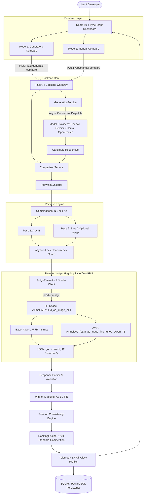

# LLM-as-a-Judge: Production-Grade LLM Evaluation & Pairwise Benchmarking Platform

[](https://www.python.org/)
[](https://pytorch.org/)
[](https://huggingface.co/spaces/Anmol2507/LLM_as_Judge_API)
[](https://huggingface.co/Qwen/Qwen2.5-7B-Instruct)
[](https://huggingface.co/Anmol2507/LLM_as_judge_fine_tuned_Qwen_7B)
[](https://fastapi.tiangolo.com)
[](https://react.dev)
[](https://www.typescriptlang.org)
[](https://www.docker.com/)

An end-to-end, production-grade LLM evaluation platform powered by a fine-tuned **Qwen2.5-7B-Instruct** judge model deployed on **Hugging Face Spaces (ZeroGPU)**. The platform features an automated pairwise evaluation engine with bidirectional position-swap bias mitigation, standard competition ranking, real-time telemetry, and a decoupled FastAPI backend with a React 19 dashboard.

---

## Model & Deployment Artifacts

| Component | Resource | Description |
| :--- | :--- | :--- |
| **Base Model** | [`Qwen/Qwen2.5-7B-Instruct`](https://huggingface.co/Qwen/Qwen2.5-7B-Instruct) | Alibaba's 7B dense autoregressive instruction-tuned transformer |
| **Fine-Tuned Adapter** | [`Anmol2507/LLM_as_judge_fine_tuned_Qwen_7B`](https://huggingface.co/Anmol2507/LLM_as_judge_fine_tuned_Qwen_7B) | Parameter-efficient LoRA adapter trained for binary correctness classification |
| **Judge Deployment** | [`Anmol2507/LLM_as_Judge_API`](https://huggingface.co/spaces/Anmol2507/LLM_as_Judge_API) | Hugging Face Spaces ZeroGPU instance serving the fine-tuned judge via Gradio API |
| **API Endpoint** | `/judge` | Remote endpoint receiving `(problem, answer_a, answer_b)` and returning strict JSON |

---

## Benchmark Snapshot

```
╔══════════════════════════════════════════════════════════════════════════════════════╗
║                     FINE-TUNED QWEN2.5-7B JUDGE — BENCHMARK SNAPSHOT                 ║
╠══════════════════════════════════════════════════════════════════════════════════════╣
║  TECHNICAL 50 SUITE                                                                  ║
║  ├── Original Accuracy:    100.0%  (50/50 correct identification)                    ║
║  ├── Reversed Accuracy:     94.0%  (47/50 correct on flipped inputs)                 ║
║  ├── Position Consistency:  94.0%  (Invariant to candidate order)                    ║
║  ├── Position Bias:          0.0%  (Zero systematic first/second placement bias)     ║
║  ├── Valid JSON Rate:      100.0%  (Strict schema adherence)                         ║
║  └── Average Latency:       1.040s (Remote ZeroGPU inference per pair)               ║
║                                                                                      ║
║  HARD 100 SUITE                                                                      ║
║  ├── Original Accuracy:     91.0%  (91/100 correct identification)                   ║
║  ├── Reversed Accuracy:     85.0%  (85/100 correct on flipped inputs)                ║
║  ├── Position Consistency:  81.0%  (Invariant to candidate order on edge cases)      ║
║  ├── Position Bias:          3.0%  (Minimal first-position drift)                    ║
║  ├── Valid JSON Rate:      100.0%  (Zero format failures)                            ║
║  └── Average Latency:       1.071s (Remote ZeroGPU inference per pair)               ║
╚══════════════════════════════════════════════════════════════════════════════════════╝
```

---

## Empirical Benchmark Results

The fine-tuned judge was evaluated on two standardized, curated evaluation suites measuring algorithmic correctness, instruction compliance, position invariance, and structured output adherence:

| Benchmark Suite | Pairs Evaluated | Original Accuracy | Reversed Accuracy | Position Consistency | Position Bias | Valid JSON Rate | Average Latency |
| :--- | :---: | :---: | :---: | :---: | :---: | :---: | :---: |
| **Technical 50** | 50 (100 runs) | **100%** | **94%** | **94%** | **0%** | **100%** | **1.040s** |
| **Hard 100** | 100 (200 runs) | **91%** | **85%** | **81%** | **3%** | **100%** | **1.071s** |

<!-- Add benchmark screenshot here -->

### Metric Definitions & Evaluation Methodology

To maintain rigorous scientific standards, metrics are decoupled into distinct dimensions:

- **Original Accuracy**: The percentage of test pairs where the judge correctly identified the ground-truth superior solution when presented in standard order $(A=\text{Good}, B=\text{Bad})$.
- **Reversed Accuracy**: The percentage of test pairs where the judge correctly identified the ground-truth superior solution when the input order was swapped $(A=\text{Bad}, B=\text{Good})$.
- **Position Consistency**: The percentage of pairs where the judge's selected winner remained identical across both permutations:
  $$\text{Consistency} = \frac{1}{N} \sum_{i=1}^{N} \mathbb{I}\left(\text{Winner}(A, B) \equiv \text{Winner}(B, A)\right)$$
  A score of $94\%$ indicates that the model's judgment was invariant to candidate positioning in 47 out of 50 test battles.
- **Position Bias**: The rate at which the model systematically favored Candidate A (first-position bias) or Candidate B (second-position bias) solely because of placement order, rather than technical merit:
  $$\text{Position Bias} = \frac{\text{Count}(\text{Winner}(A, B) = A \land \text{Winner}(B, A) = A)}{N}$$
- **Valid JSON Rate**: The percentage of inference responses that parsed cleanly into the target schema without requiring markdown stripping fallback or regex extraction retries.
- **Average Latency**: End-to-end wall-clock time per pairwise call over the remote Gradio client connection on Hugging Face ZeroGPU.

> [!NOTE]
> **Derived Aggregate Notice**: Combining both benchmark suites yields a weighted average consistency of $85.3\%$ across 150 test pairs (300 total evaluations). This aggregate is a derived post-hoc metric and should not be confused with raw benchmark accuracy.

---

## Problem Statement

Evaluating large language models on technical and coding tasks presents three significant production bottlenecks:

1. **Prohibitive Commercial API Costs**: Relying on frontier models (such as GPT-4o or Claude 3.5 Sonnet) as automated judges costs between $\$2.50$ and $\$15.00$ per million tokens, making continuous integration and large-scale offline benchmarking cost-prohibitive.
2. **Subjective & Noisy Scoring Rubrics**: Multi-criterion rating rubrics (e.g., scoring clarity, completeness, or tone from 1 to 10) frequently suffer from criterion hallucination, grade inflation, and lack of ground-truth calibration.
3. **Severe Position Bias**: Standard LLMs exhibit strong primacy and recency bias, favoring whichever answer is presented first up to $30\text{--}40\%$ of the time, leading to corrupted evaluations in $A/B$ testing.

---

## The Solution

**LLM-as-a-Judge** solves these challenges by combining:
- A **compact, specialized 7B parameter judge model** fine-tuned with LoRA on balanced technical and code-generation pairs.
- A **strict binary correctness classification objective** (`{"A": "correct", "B": "incorrect"}`) rather than subjective point scales.
- An **automated bidirectional position-swap engine** that evaluates both $(A, B)$ and $(B, A)$ to verify invariance.
- A **zero-infrastructure cost deployment** on Hugging Face Spaces (ZeroGPU) accessible over an async Gradio API bridge.

---

## System Architecture



---

## How the Judge Works

### Input Prompting & Interface

The judge is presented with the candidate answers formatted cleanly:

```text
PROBLEM:
{problem}

ANSWER A:
{answer_a}

ANSWER B:
{answer_b}

Evaluate both answers independently.
Return ONLY the required JSON.
```

### Strict JSON Output Contract

The fine-tuned model is constrained to return a single JSON object with exact keys `"A"` and `"B"`:

```json
{
  "A": "correct",
  "B": "incorrect"
}
```

Allowed labels are strictly limited to `correct` and `incorrect`.

### Deterministic Winner Resolution

The platform eliminates subjective weighting by mapping binary correctness outcomes directly to tournament winners:

| Answer A Evaluation | Answer B Evaluation | Winner Assigned | Confidence | Reason Text |
| :---: | :---: | :---: | :---: | :--- |
| `correct` | `incorrect` | **A** | $1.00$ | *"Answer A was judged correct while Answer B was judged incorrect."* |
| `incorrect` | `correct` | **B** | $1.00$ | *"Answer B was judged correct while Answer A was judged incorrect."* |
| `correct` | `correct` | **TIE** | $0.50$ | *"Both answers were judged correct."* |
| `incorrect` | `incorrect` | **TIE** | $0.50$ | *"Both answers were judged incorrect."* |

---

## Pairwise Evaluation & Position-Swap Verification

For an arbitrary set of $N$ candidate answers ($N \in [2, 4]$), the evaluation engine generates all unique battle pairings using the combinatorial formula:

$$\text{Total Battles} = \frac{N(N - 1)}{2}$$

- **2 Models**: $1$ comparison
- **3 Models**: $3$ comparisons
- **4 Models**: $6$ comparisons

### Bidirectional Position-Swap Mechanism

When `position_swap_check=True`, the evaluator automatically runs each pair twice:
1. **Forward Battle**: Passes $(\text{Answer}_A, \text{Answer}_B)$. Evaluator assigns relative winner ($A$ or $B$), mapped to model ID $M_1$.
2. **Reverse Battle**: Passes $(\text{Answer}_B, \text{Answer}_A)$. Evaluator assigns relative winner ($A$ or $B$), mapped to model ID $M_2$.
3. **Consistency Verification**: Checks if $M_1 \equiv M_2$.

If $M_1 \neq M_2$, the system flags a **Position Bias Warning** in the telemetry and records the failure mode without corrupting the tournament standings.

---

## Model Fine-Tuning & Training Pipeline

The judge model was trained using Parameter-Efficient Fine-Tuning (PEFT) with Low-Rank Adaptation (LoRA) on the base model `Qwen/Qwen2.5-7B-Instruct`.

### Training Hyperparameters

```python
# LoRA Configuration
lora_config = LoraConfig(
    r=8,                            # Rank
    lora_alpha=16,                  # Alpha scaling parameter
    lora_dropout=0.05,              # Dropout probability
    bias="none",
    target_modules=[                # Target all self-attention projections
        "q_proj",
        "k_proj",
        "v_proj",
        "o_proj"
    ],
    task_type="CAUSAL_LM"
)

# Training Arguments
training_args = TrainingArguments(
    output_dir="./lora_qwen_judge",
    num_train_epochs=1,
    learning_rate=1e-4,
    per_device_train_batch_size=1,
    gradient_accumulation_steps=8,  # Effective batch size = 16 across 2 GPUs
    warmup_steps=300,
    optim="paged_adamw_8bit",       # Memory-optimized optimizer
    gradient_checkpointing=True,     # Activations recomputation
    fp16=True,                      # Mixed precision
    max_seq_length=768,             # Max sequence context
    logging_steps=50,
    save_strategy="steps",
    save_steps=500
)
```

### Hardware & Distributed Setup
- **Compute**: $2 \times \text{NVIDIA Tesla T4}$ GPUs ($16\text{ GB}$ VRAM each).
- **Orchestration**: Distributed Data Parallel (DDP) executed via `torchrun`.
- **Memory Optimization**: 8-bit Paged AdamW combined with gradient checkpointing prevented activation spikes while fitting comfortably within the 16 GB memory envelope.

### Assistant-Only Loss Masking

To ensure the model learned to produce the exact JSON format without wasting gradient capacity on the user prompt, **assistant-only loss supervision** was enforced. All prompt tokens (Problem, Answer A, Answer B) were masked with a label of `-100`, directing the cross-entropy loss calculation exclusively toward the generated assistant output tokens (`{"A": "...", "B": "..."}`).

---

## Training Dataset

The model was fine-tuned on a curated dataset of **25,000 balanced pairs** sampled from a cleaned corpus of **53,944 examples**:

| Source Dataset | Cleaned Corpus | Filtered Training Split | Domain & Task Type |
| :--- | :---: | :---: | :--- |
| **LMSYS Chatbot Arena** | 44,947 examples | **20,800 examples** | Human-rated pairwise battles covering general reasoning, technical explanations, and logic. |
| **Code Edit DPO** | 8,997 examples | **4,200 examples** | Code repair, algorithmic problem solving, syntax validation, and edge-case correctness. |
| **Total** | **53,944 examples** | **25,000 examples** | **Balanced across correct/incorrect outcomes** |

---

## Backend Implementation (FastAPI)

The backend is built with FastAPI adhering to clean, service-oriented architecture:

### Endpoints

- **`POST /api/manual-compare`**: Mode 2 comparison. Directly compares 2 to 4 candidate answers entered by the user without invoking upstream LLM APIs.
- **`POST /api/generate-compare`**: Mode 1 comparison. Concurrently dispatches requests to upstream model providers (OpenAI, Gemini, Anthropic, DeepSeek, Mistral, Ollama, OpenRouter, Grok), collects generated texts, and pipes them directly into pairwise judging.
- **`GET /api/models`**: Lists available models with dynamic availability computation based on system or per-user configured API keys.
- **`POST /api/sessions/{id}/save`**: Selectively persists prompts, answers, evaluations, and metrics to SQLite or PostgreSQL.
- **`POST /api/auth/register` & `POST /api/auth/login`**: User authentication with PBKDF2 password hashing and HMAC tokens.
- **`GET /api/user/keys` & `POST /api/user/keys`**: Secure per-user API key storage encrypted with Fernet symmetric cryptography.

### Concurrency & Thread-Safety

Because the Hugging Face ZeroGPU Space processes requests sequentially, `PairwiseEvaluator` serializes judge executions via `asyncio.Lock()`. Synchronous network calls via `gradio_client` are offloaded to worker threads with `asyncio.to_thread` to ensure the FastAPI event loop remains unblocked.

---

## Frontend Implementation (React 19 + TypeScript)

The frontend is built with React 19, TypeScript, and Vite featuring an Obsidian Cyber dark theme:

- **Leaderboard**: Displays 1224 Standard Competition Rankings with win rates, correctness percentages, and $W-L-T$ match records.
- **Pairwise Battles**: Detailed breakdown of every head-to-head match showing Candidate A vs Candidate B, assigned winner, and individual correctness indicators (`#34D399` Correct / `#FBBF24` Incorrect).
- **Position-Swap Badge**: Real-time visual indicator showing whether swapping candidate positions yielded identical winners.
- **Candidate Answers View**: Formatted answer cards with syntax highlighting, latency telemetry, output token counts, and one-click copy to clipboard.
- **Telemetry & Raw Data**: Full session JSON inspector including judge latency, wall-clock session duration, and raw judge responses.

---

## Programmatic API Usage

You can query the deployed Hugging Face judge directly using Python:

```python
from gradio_client import Client

# Initialize client pointing to the ZeroGPU Space
client = Client("Anmol2507/LLM_as_Judge_API")

# Problem and candidate solutions
problem = "Write a Python function to check if a number is prime."
answer_a = """
def is_prime(n):
    if n < 2:
        return False
    for i in range(2, int(n**0.5) + 1):
        if n % i == 0:
            return False
    return True
"""
answer_b = """
def is_prime(n):
    return n % 2 == 0
"""

# Call the remote judge endpoint
result = client.predict(
    problem=problem,
    answer_a=answer_a,
    answer_b=answer_b,
    api_name="/judge"
)

print("Judge Output:", result)
# Output: {"A": "correct", "B": "incorrect"}
```

---

## Project Structure

```text
LLM_as_Judge/
├── src/
│   ├── api/
│   │   ├── dependencies.py          # Dependency injection container
│   │   ├── main.py                  # FastAPI application setup, CORS, lifespan
│   │   ├── routes/                  # API endpoints
│   │   │   ├── auth.py              # User authentication endpoints
│   │   │   ├── compare.py           # /api/manual-compare
│   │   │   ├── generate.py          # /api/generate-compare
│   │   │   ├── models.py            # Model registry catalog endpoints
│   │   │   ├── sessions.py          # Session persistence endpoints
│   │   │   └── user_keys.py         # Encrypted API key management
│   │   └── schemas/                 # Pydantic request and response models
│   ├── config/
│   │   ├── pricing.py               # Centralized LLM pricing matrix
│   │   └── settings.py              # Environment configuration loader
│   ├── database/
│   │   ├── connection.py            # SQLAlchemy engine, session maker, SQLite/PostgreSQL
│   │   ├── models.py                # ORM models (User, Session, Result, ApiKey)
│   │   └── repository.py            # Data access layer
│   ├── evaluation/
│   │   ├── benchmark.py             # Basic dataset evaluation runner
│   │   ├── hard_benchmark.py        # 100-pair hard benchmark engine
│   │   ├── metrics.py               # Telemetry tracker (latencies, tokens, costs)
│   │   ├── pairwise.py              # PairwiseEvaluator with position-swap logic
│   │   ├── position_bias.py         # Position bias evaluation runner
│   │   ├── ranking.py               # RankingEngine (1224 Standard Competition)
│   │   ├── report_generator.py      # Final report formatter
│   │   └── technical_benchmark.py   # 50-pair technical benchmark engine
│   ├── judge/
│   │   ├── evaluator.py             # Remote JudgeEvaluator (Gradio Client)
│   │   ├── model_loader.py          # JudgeManager with concurrency lock
│   │   └── prompts.py               # Prompt templates
│   ├── providers/                   # Upstream LLM provider adapters
│   │   ├── anthropic_provider.py    # Anthropic API adapter
│   │   ├── base.py                  # BaseProvider interface
│   │   ├── deepseek_provider.py     # DeepSeek API adapter
│   │   ├── gemini_provider.py       # Google Gemini API adapter
│   │   ├── grok_provider.py         # xAI Grok API adapter
│   │   ├── mistral_provider.py      # Mistral API adapter
│   │   ├── mock_provider.py         # Mock provider for automated testing
│   │   ├── ollama_provider.py       # Local Ollama adapter
│   │   ├── openai_provider.py       # OpenAI API adapter
│   │   ├── openrouter_provider.py   # OpenRouter API adapter
│   │   └── registry.py              # Model catalog and availability manager
│   └── services/
│       ├── auth.py                  # PBKDF2 hashing, Fernet key encryption
│       ├── comparison_service.py    # End-to-end Mode 1 and Mode 2 orchestrator
│       ├── cost_calculator.py       # Per-model financial token cost calculator
│       ├── generation_service.py    # Concurrent async candidate generation
│       └── hf_judge_client.py       # Standalone Hugging Face Gradio client
├── frontend/                        # React 19 + TypeScript + Vite web app
│   ├── src/
│   │   ├── components/              # UI Components (ResultsDashboard, PromptInput, etc.)
│   │   ├── services/api.ts          # Frontend API client
│   │   ├── types/evaluation.ts      # TypeScript interfaces
│   │   ├── App.tsx                  # Root application view
│   │   └── index.css                # Obsidian cyber stylesheet
│   ├── package.json
│   └── vite.config.ts
├── outputs/
│   └── benchmarks/                  # Empirical benchmark result JSON files
│       ├── hard_technical_100_results.json
│       ├── latest_results.json
│       ├── position_bias_results.json
│       └── technical_50_results.json
├── scripts/
│   ├── create_commit_history.py
│   └── download_models.py           # Base model download utility
├── tests/                           # Pytest test suite (unit, API, E2E)
├── Dockerfile                       # Multi-stage production container
├── Procfile                         # Cloud PaaS deployment configuration
├── requirements.txt                 # Python dependencies
└── .env.example                     # Example environment variables
```

---

## Local Development Setup

### 1. Prerequisites
- Python 3.11+
- Node.js 18+ and npm
- Git

### 2. Backend Setup

```bash
# Clone repository
git clone https://github.com/AnmolRajpoot25/LLM_as_Judge.git
cd LLM_as_Judge

# Create and activate Python virtual environment
python -m venv .venv
# On Windows:
.venv\Scripts\activate
# On Linux/macOS:
source .venv/bin/activate

# Install dependencies
pip install -r requirements.txt

# Copy environment configuration
cp .env.example .env
```

### 3. Frontend Setup

```bash
cd frontend
npm install
cd ..
```

### 4. Running the Platform

In Terminal 1 (FastAPI Backend):
```bash
python -m uvicorn src.api.main:app --host 127.0.0.1 --port 8000 --reload
```
API Documentation will be available at `http://127.0.0.1:8000/docs`.

In Terminal 2 (React Frontend):
```bash
cd frontend
npm run dev
```
Open `http://localhost:5173` in your browser.

---

## Deployment Options

### Docker Deployment

A lightweight `Dockerfile` is included for containerized environments:

```bash
# Build Docker image
docker build -t llm-judge:latest .

# Run container
docker run -p 8000:8000 --env-file .env llm-judge:latest
```

### Cloud PaaS (Render / Railway / Heroku)

The repository includes a `Procfile` ready for one-click web service deployment:

```text
web: uvicorn src.api.main:app --host 0.0.0.0 --port ${PORT:-8000}
```

Set the environment variable `CORS_ALLOWED_ORIGINS` to include your production frontend URL (e.g. `https://your-app.vercel.app`).

---

## Known Limitations

- **Coarse-Grained Binary Outputs**: The model outputs discrete `correct` / `incorrect` classifications without generating chain-of-thought derivation or natural-language qualitative feedback.
- **No Native Logit Confidence**: Confidence is assigned deterministically based on separation ($1.00$ for separated answers, $0.50$ for ties) rather than soft probability logits.
- **ZeroGPU Cold Starts & Queuing**: Free Hugging Face ZeroGPU Spaces experience cold-start latency ($20\text{--}40\text{s}$) when waking from sleep and variable queuing latency under high community traffic.
- **Domain Focus**: Fine-tuning was concentrated on coding, technical reasoning, and instruction following; performance on open-ended creative writing or stylistic prose has not been benchmarked.

---

## Future Improvements

- [ ] **Chain-of-Thought Distillation**: Fine-tune the judge to output a brief 1–2 sentence derivation before the final JSON decision block.
- [ ] **Dedicated High-Throughput Serving**: Deploy the adapter using vLLM or TensorRT-LLM on dedicated cloud GPUs (A10G or L4) for sub-200ms latency.
- [ ] **Logit-Based Confidence Calibration**: Extract raw token log-probabilities to compute true calibrated Bayesian confidence intervals.
- [ ] **Expanded Multi-Turn Benchmark**: Expand evaluation datasets to multi-turn agentic conversations and complex software refactoring tasks.

---

## Engineering Highlights

- **Parameter-Efficient LoRA Adaptation**: Achieved state-of-the-art technical classification by fine-tuning only $0.06\%$ of total model parameters ($8$ rank on attention projections).
- **Assistant-Only Loss Masking**: Enforced clean output formatting by eliminating loss backpropagation on prompt tokens.
- **Symmetric Dual-Pass Invariance**: Embedded position-swap checking directly into the tournament pipeline to expose and prevent placement bias.
- **Zero-Cost Remote Serving**: Integrated Hugging Face ZeroGPU through an asynchronous Gradio API bridge with thread offloading.
- **Resilient Multi-Provider Integration**: Integrated 8 model providers with fallback handling so single-model generation outages never crash ongoing tournaments.

---

## Why This Project Matters

This project demonstrates production-grade full-stack ML engineering:
- **LLM Fine-Tuning**: Practical experience with LoRA, PEFT, 8-bit optimizers, and gradient checkpointing on consumer-accessible GPUs.
- **Evaluation Science**: Designing evaluation systems that address known vulnerabilities in LLM benchmarking (such as position bias and verbosity bias).
- **Modern Cloud Architecture**: Integrating remote serverless ML inference (Hugging Face Spaces) with async backends (FastAPI) and reactive frontends (React 19).

---

## Author & Acknowledgements

- **Author**: Anmol Rajpoot
- **Hugging Face Model**: [Anmol2507/LLM_as_judge_fine_tuned_Qwen_7B](https://huggingface.co/Anmol2507/LLM_as_judge_fine_tuned_Qwen_7B)
- **Hugging Face Space**: [Anmol2507/LLM_as_Judge_API](https://huggingface.co/spaces/Anmol2507/LLM_as_Judge_API)
- **Base Architecture**: Qwen Team / Alibaba Cloud
